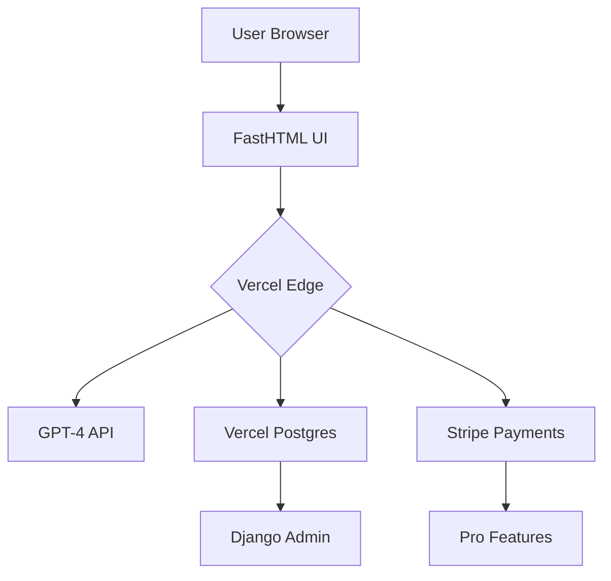

**DeadDevelopers.com - Comprehensive Spec Sheet**  
**Mission**: AI-First Developer Community Platform for developers using AI in ≥80% of their workflow  

---

### **Core Tech Stack**  
| **Component**          | **Technology**               | **Purpose**                                                                 |  
|-------------------------|-------------------------------|-----------------------------------------------------------------------------|  
| **Frontend**            | FastHTML                      | Python-based UI, real-time WebSockets, HTMX interactivity                   |  
| **Backend**             | Django (Light Use)            | User auth, ORM, admin panel, data models                                    |  
| **Hosting**             | Vercel Pro                    | Global edge deployment, AI serverless functions, instant scaling           |  
| **Database**            | Vercel Postgres               | Managed PostgreSQL with vector extensions for AI data                      |  
| **AI/ML**               | OpenAI GPT-4 + Vercel AI SDK  | Code generation, optimization, chat, and challenge evaluation               |  
| **Blog CMS**            | Hashnode Headless             | Developer-focused blogging with custom domain support                       |  
| **Payments**            | Stripe                        | Subscriptions, one-time payments, invoicing                                 |  
| **SEO**                 | Vercel Speed Insights         | Auto-optimized performance, edge caching, sitemap generation               |  

---

### **Feature List**  
**1. AI Pair Programming Console**  
- **Tech**: FastHTML WebSockets + GPT-4  
- **Description**:  
  Real-time code collaboration where users paste code and receive AI optimizations.  
  - Auto-suggestions inline  
  - Code diff visualization  
  - Context-aware GPT-4 prompts  

**2. User Authentication**  
- **Tech**: FastHTML Sessions + Django Auth  
- **Description**:  
  Secure login system tracking AI usage % and skill levels.  
  - OAuth2 via GitHub/GitLab  
  - Session-based security  
  - Public profiles showing "AI Dev Score"  

**3. AI-Generated Coding Challenges**  
- **Tech**: Django ORM + GPT-4  
- **Description**:  
  Daily/weekly challenges with AI-generated bugs to fix.  
  - Auto-evaluation via AI  
  - Difficulty tiers (Novice → AI Master)  
  - Leaderboards with "AI Efficiency" metrics  

**4. Developer Blog & Articles**  
- **Tech**: Hashnode Headless API + FastHTML  
- **Description**:  
  User/Admin-authored technical content with AI-assisted drafting.  
  - Markdown support  
  - Code snippet embedding  
  - "AI Co-Author" drafting tool  

**5. Forums & Discussion**  
- **Tech**: django-machina + FastHTML Components  
- **Description**:  
  AI-moderated forums for troubleshooting and project sharing.  
  - GPT-4 spam detection  
  - Code block syntax highlighting  
  - Thread tagging by AI usage %  

**6. Pro Subscriptions**  
- **Tech**: Stripe + Django Models  
- **Description**:  
  Paid tiers unlocking advanced AI tools and community features.  
  - Priority GPT-4 access  
  - Private code reviews  
  - Custom AI agent creation  

**7. Job Board**  
- **Tech**: Django ORM + Vercel Edge Config  
- **Description**:  
  AI-focused job listings with auto-tagging.  
  - "AI Toolchain" filters (Copilot, CodeLlama, etc.)  
  - Salary estimator via GPT-4  
  - Company AI adoption scores  

**8. Activity Feeds**  
- **Tech**: Django Stream Framework + FastHTML  
- **Description**:  
  Personalized feed showing AI-centric community activity.  
  - "AI Usage Milestones"  
  - Challenge completions  
  - Trending AI tools discussions  

**9. Live Collaborative IDE**  
- **Tech**: FastHTML WebSockets + CodeMirror  
- **Description**:  
  Browser-based editor with AI pair programmer.  
  - Real-time collaboration  
  - GPT-4 code completions  
  - Vercel Edge-powered execution  

**10. SEO & Content Strategy**  
- **Tech**: Vercel Speed Insights + GPT-4  
- **Description**:  
  Auto-generated technical content targeting AI developers.  
  - AI-authored tutorials  
  - Schema markup for code examples  
  - Competitor gap analysis  

---

### **AI-Specific Feature Details**  
**AI Code Review API**  
- **Stack**: Vercel Edge Functions + GPT-4  
- **Flow**:  
  ```python  
  @app.ws('/review')  
  async def ai_review(websocket):  
      await websocket.accept()  
      code = await websocket.receive_text()  
      analysis = openai.chat.completions.create(  
          model="gpt-4-code",  
          messages=[{"role": "user", "content": f"Review: {code}"}]  
      )  
      await websocket.send_text(analysis.choices[0].message.content)  
  ```

**AI Usage Analytics**  
- **Stack**: Django Models + Vercel Analytics  
- **Metrics**:  
  - % AI-generated code per user  
  - AI toolchain preferences  
  - Challenge success rate by AI reliance  

---

### **Architecture Diagram**  


This spec aligns with your vision of a **developer community where AI is the primary collaborator**, using FastHTML for real-time Python-driven UI and Vercel Pro to maximize your subscription value.

